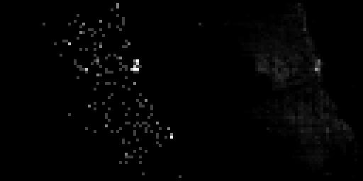

# AI based crime prediction

An experimental set of tools that use TensorFlow 2.0 and Keras to predict where (and how many) upcoming crimes will occur.
[The Chicago crime database from 2001 to present](https://data.cityofchicago.org/Public-Safety/Crimes-2001-to-present/ijzp-q8t2) is used for this. 
The coordinates of crimes are first converted into a sequence of 64x64 greyscale images, spanning 6 hours per image.
The goal is to predict the next image in the sequence. This is done with a convolutional LSTM, surrounded by convolutional and deconvolutional layers.
Experiments were run on an NVIDIA GeForce GTX 760 and were therefore relatively limited. The loss converged after few epochs.

## Visualization

Shown below are two true crime heatmaps (left) as well as the neural network's prediction based on the previous images in the sequence (right).

  

## Results

The neural network quickly learns to create an average crime rate map of Chicago, including relatively sharp coast lines.
It also predicts changes of the overall crime rate based on the time of day.
However, more precise location seems sporadic. The network fails to create truly useful estimates for predicting where crimes will occur in the future.

This makes sense, as the world is very complex and modelling crime map sequences is either infeasible or requires
a much larger neural network, more processing time and more training data.